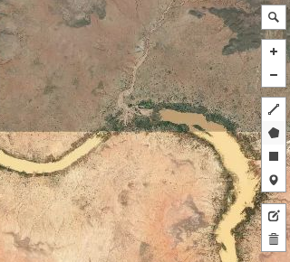
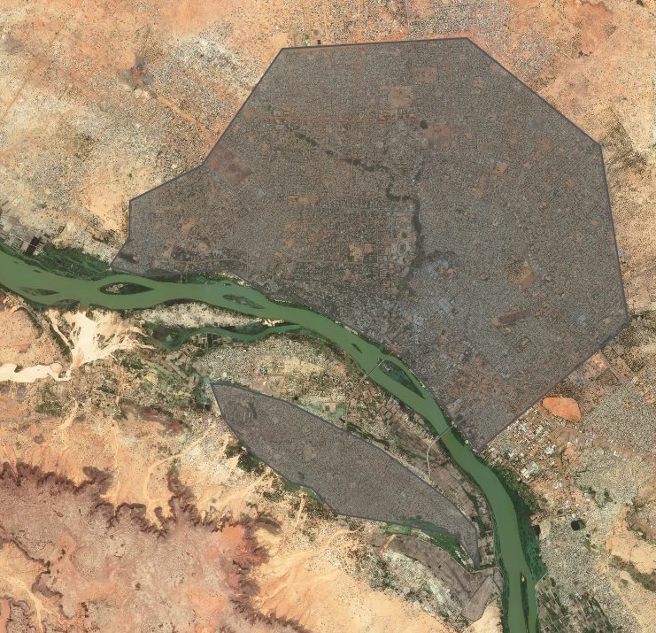
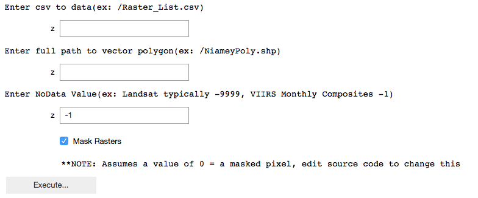
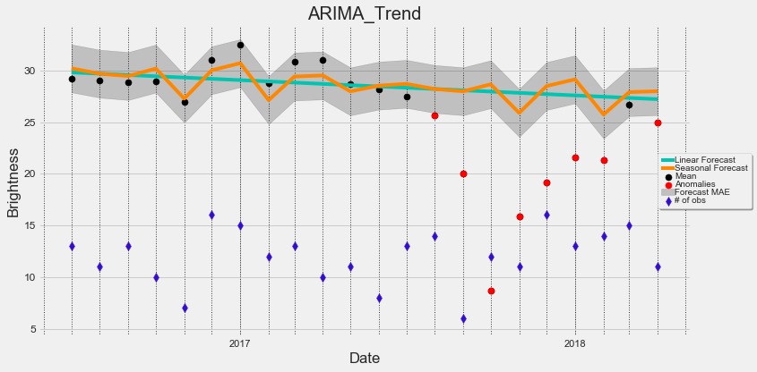
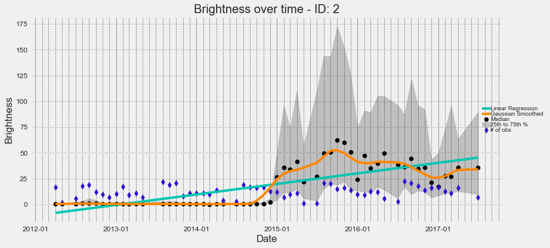
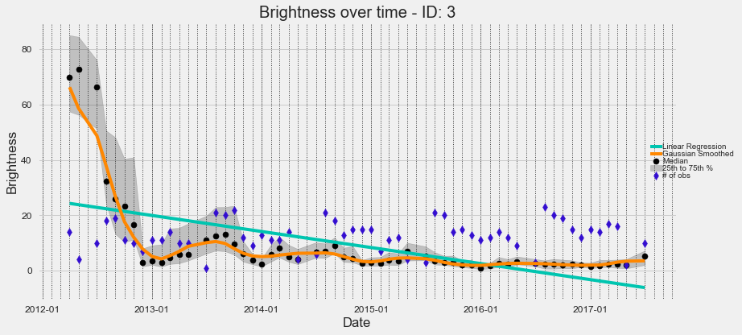
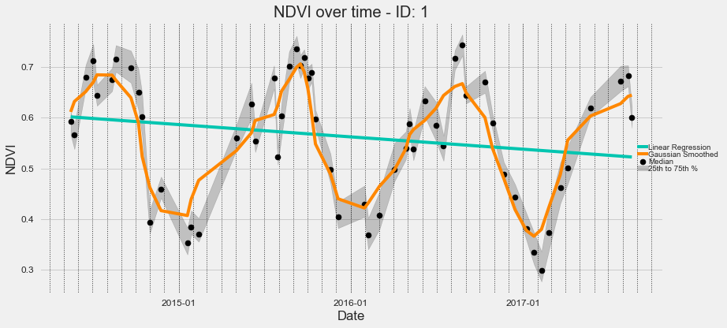
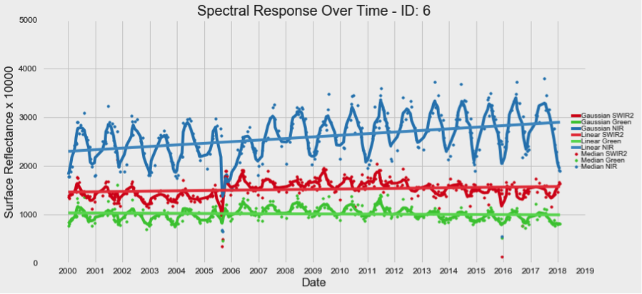

<h1 align="center">Comet Time Series (CometTS) Visualizer</h1>


<p align="center">


   


<a href="https://codecov.io/gh/jshermeyer/cometts"></a>
</p>

- [Installation Instructions](#installation-instructions)
- [Dependencies](#dependencies)
- [License](#license)
---


## Base Functionality
The Comet Time Series tool is an open source jupyter notebook and command line utility that enables users to visualize or extract relevant statistics from a time series of overhead imagery within a specific area. A user can input a time series raster dataset and a polygon vector file (i.e., shapefile or geojson) that contains an area or set of areas. Within each area, a .csv file will be output containing relevant statistics. A plot will also be produced to enable simple yet effective visualizations.  Following a base analysis, CometTS enables anomaly detection using a user-specified historical baseline of time series imagery, and monthly Auto-Regressive Integrated Moving Average (ARIMA) Analysis.  Detailed workflows are described below.


Check out the expansion pack & users guide for working with Landsat imagery [here.](https://github.com/CosmiQ/CometTS/blob/master/Landsat_Expansion_Docs_HelperScripts/Landsat_Expansion_CometTS_UsersGuide.docx)


## Installation
Python 2.7 or 3.6 are the base requirements plus several packages.  CometTS can be installed in multiple ways including conda, pip, docker, and cloning this repository.


### Clone it
We recommend cloning to add all sample data and easier access to the jupyter notebooks that leverage our plotting functions.
```
git clone https://github.com/CosmiQ/CometTS.git
```
If you would like the full functionality of a python package we have several options.

### pip
```
pip install CometTS
```
pip installs may fail on macs with python3 as GDAL is finicky.  Use some of the alternative approaches below.

### Docker
```
docker pull jss5102/cometts
cd CometTS
docker build .
docker start CometTS
```

### Conda
Create a conda environment!

```
git clone https://github.com/CosmiQ/CometTS.git
cd CometTS
conda env create -f environment.yml
source activate CometTS
```

### Dependencies
All dependencies can be found in the docker file [Dockerfile](./Dockerfile) or
[environment.yml](./environment.yml) or [requirements.txt](./requirements.txt).

## Dataset Acquisition & Organization
The first dataset we tested this tool with was [Suomii NPP VIIRS Nightlights Monthly Composite Data](https://ngdc.noaa.gov/eog/viirs/download_dnb_composites.html). After download, the imagery will simply need to be unzipped using your tool of choice and formatted as described below. This repo also contains a limited amount of VIIRS sample data over San Juan, Puerto Rico.  Note if you are downloading from the NOAA website that these data are incredibly large in size and may take considerable time (e.g., over a day) to download the whole dataset for the entire earth (i.e., ~1TB of data). Another option is downloading just 1/6th of the data for the earth.  Uncompressed, this will be about 200GB.

Data should be stored in a hierarchical folder pattern that is common for remote sensing applications.

    VIIRSData/
    └── Lat075N_Long060W
        ├── SVDNB_npp_20120401-20120430_75N060W_vcmcfg_v10_c201605121456
        │   ├── SVDNB_npp_20120401-20120430_75N060W_vcmcfg_v10_c201605121456.avg_rade9
        │   ├── SVDNB_npp_20120401-20120430_75N060W_vcmcfg_v10_c201605121456.cf_cvg
        ├── SVDNB_npp_20120501-20120531_75N060W_vcmcfg_v10_c201605121458
        │   ├── SVDNB_npp_20120501-20120531_75N060W_vcmcfg_v10_c201605121458.avg_rade9
        │   ├── SVDNB_npp_20120501-20120531_75N060W_vcmcfg_v10_c201605121458.cf_cvg.tif
        ├── SVDNB_npp_20120601-20120630_75N060W_vcmcfg_v10_c201605121459

        ...


If you are using non-VIIRS data, this pattern will remain consistent regardless. Data should be organized into exclusive areas with identical extents. The most important element of this structure is that images on different dates are stored in their own separate subdirectory. Mask bands should be stored in the same subdirectory as your time series data.


## Workflow Example

### Create Areas of Interest
After the raster data are organized appropriately, you are ready to begin a workflow. The secondary input is simply a polygon vector file which will direct your analysis and calculate the relevant statistics and plots. Polygons can be created in QGIS, the GIS software of your choice, or can be done online. One such way is going to  http://geojson.io/ and using the tool.

Simply select the polygon tool on the top right hand side of the screen.



You may want to switch to satellite imagery to easily identify features, then draw your areas of interest. You can select multiple areas from around the earth, or stick to one location. Be sure that the areas you are drawing fall within the bounds of your raster data. Save the data and you will be ready to work with the tool and generate your outputs. Figure A is an example of polygons drawn in Niamey, Niger. Plots and relevant statistics will be created for both of these polygons for the entire timespan of your raster data.




After downloading the zipped geojson or shapefile, save it somewhere. Ensure that the shapefile is in the same projection as your raster data! Otherwise it will appear the data are not overlapping and no statistics will be calculated!

### Create a CSV that documents your data structure
The process works by first iterating through the folder structure and creating a .csv file that indicates where each raster is stored, the date of each image, optionally the number of observations (if using monthly or annual composite data), and optionally a mask band for each of your time series raster images.

#### CLI

```
CometTS.CSV_It -h

usage: CometTS.CSV_It [-h] [--input_dir INPUT_DIR] [--TSdata TSDATA]
                      [--Observations OBSERVATIONS] [--Mask MASK]
                      [--DateLoc DATELOC] [--BandNum BANDNUM]
                      [--output_dir OUTPUT_DIR]

```

For more info on these commands run in terminal or see the walkthrough below

#### Jupyter Notebook
Open the iPython-notebook program (terminal > jupyter notebook) and then follow the instructions below. The CSV_Creator notebook creates the .csv input for you. You need to point the script to the appropriate place in your directory structure (The Lat075N_Long060W Folder from the above hierarchy graph.) From here, follow the instructions in the notebook. The script will use a filename character search pattern to pull out the appropriate files and, more importantly, the location of the date in your filename.

As an example, a file with the name S_VIIRS_20170407_XYZ.tif contains the date information within the filename in positions 8 through 16 in YMD format (2017, April 7th). Feeding "8:16" to the CSV_Creator script will pull out the relevant date information.

VIIRS monthly composite data has two bands that can be useful for time series analysis. The first documents the night-time brightness on the ground (S* rade9.tif) and the second documents the number of observations that contribute to each monthly composite (S* cvg.tif). The observation band can be used to plot the number of observations AND as a mask band. If there are 0 observations in a pixel for a month, that does not mean that brightness is 0, simply that there are no observations typically due to cloud cover. As such, these data should be masked out.

Here is the CSV structure:

An example input CSV is also distributed with this repository (Raster_List.csv).


##### Required columns:
File (Your time series data)

TS_Data (A binary listing indicating that a file is indeed part of your Time Series data and not an observation file)

date (The date of each time series observation extracted from the images filename)

##### Optional columns:
Mask (Your mask raster to mask out any anamolous pixels)

extent (The extent of your image- may be used in future iterations of the code)

obs (A binary listing indiciating whether a file is an observation band)

band (A band number- may be useful if working with multi-spectral imagery like Landsat)

### Analyze your Data
CometTS will run through and calculate the statistical central tendencies and amount of statistical spread present in the data over time. It will then plot this data and apply regression lines to it. Additionally, tabular data in a .csv format will be output in the same folder that contains your raster data.

#### CLI
```
CometTS -h

usage: CometTS [-h] [--input_csv INPUT_CSV] [--zonalpoly ZONALPOLY]
               [--NoDataValue NODATAVALUE] [--mask_value MASK_VALUE]
               [--maskit MASKIT] [--Path_out PATH_OUT]
```

#### Jupyter Notebook
Open the Comet Time series Visualizer Notebook and run the top cell. Enter the location to your .csv that you created above, then to the path where your polygonised area of interest (AOI)  features are stored. Select if you have mask data you would like to use as well by checking or unchecking the checkbox.

The program assumes that your mask pixel value equals 0. You can modify this in the "Mask_It" function if your mask band has multiple values you would like to mask out, or simply a different value than 0. Additionally you should specify the no data value for your time series data. Landsat imagery has a no data value of -9999, and any negative value for VIIRS data is an acceptable no data value.

When your paths are set, click the “Execute…” button. This will then create the relevant statistics over time by iterating through your rasters. The amount of time this will take will depending upon the number of rasters and different AOIs you are analyzing at one time.





Once finished, the statistical data will be output in a .csv format and will allow for ingestion into other statistical software.  Alternatively, these data can be easily manipulated and plotted using the run_plot function and the final cell in the notebook.

### Anomaly Detection



CometTS has expanded its functionality and now uses auto-regressive integrated moving average (ARIMA) analysis to detect anomalies in a time-series of data.  We have a built in function to calculate this for you automatically.

#### CLI
ARIMA must be run from the command line.
```
CometTS.ARIMA -h

usage: CometTS.ARIMA [-h] [--CometTSOutputCSV COMETTSOUTPUTCSV]
                     [--ARIMA_CSV ARIMA_CSV] [--CMA_Val CMA_VAL]
                     [--CutoffDate CUTOFFDATE] [--Uncertainty UNCERTAINTY]

optional arguments:
  -h, --help            show this help message and exit
  --CometTSOutputCSV COMETTSOUTPUTCSV
                        Enter CSV output from CometTS script, as input for
                        ARIMA, default: /Library/Frameworks/Python.framework/V
                        ersions/3.6/lib/python3.6/site-
                        packages/CometTS/VIIRS_Sample/San_Juan_FullStats.csv
  --ARIMA_CSV ARIMA_CSV
                        Enter ARIMA CSV output name: /Library/Frameworks/Pytho
                        n.framework/Versions/3.6/lib/python3.6/site-packages/C
                        ometTS/VIIRS_Sample/San_Juan_ARIMA_Output.csv
  --CMA_Val CMA_VAL     Default is 3. Centered Moving Average Value for ARIMA,
                        set to an odd number >=3
  --CutoffDate CUTOFFDATE
                        Default is 2017/08/15. Format YYYY/MM/DD. Split data
                        into a before and after event, i.e. a Hurricane. If no
                        event simply set as last date in dataset, or a middle
                        date. Ensure you have at least 14 months of data to
                        pull out an historical trend
  --Uncertainty UNCERTAINTY
                        Default is 2. Multiplier for the mean absolute error from the ARIMA
                        forecast, for shorter time series a greater uncertainty
                        value is likely required so anomalies are not overly
                        flagged.  For long time series set equal to 1. User discretion advised.
```

### Plot and Visualize your Data
This notebook offers some time series plotting functionality. It enables visualization and a first look evaluation that will allow for some basic conclusions to be drawn. Check out a few of our plotting notebooks:
```
Plot_Results.ipynb
ARIMA_Plotting.ipynb
Plot_Results-Landsat.ipynb
```

These scripts will add regression lines, plot the number of observations present, check out the statistical spread or identify anomalies. Enhanced functionality can be acquired if using more sophisticated plotting tools, such as Plotly. For a deeper dive into the statistics, it is recommended you use a statistical analysis software.


#### Agadez, Niger

Seasonal variation in brightness that likely indicates seasonal migrations and population fluctuations in central Niger, Africa.


#### Suruc Refugee Camp, Turkey

Increase in brightness coinciding with the establishment of a refugee camp in southern Turkey, north of Syria.


#### Allepo, Syria

Brightness declines (i.e., putative population decline) as a result of Syrian Civil War and military actions in Aleppo.


#### NDVI Visualization north of Houston, Texas

A visualization of the Normalized Difference Vegetation Index (NDVI) in a field north of Houston using a time-series of Landsat imagery.


## Landsat Expansion Pack

Extra code for working with Landsat imagery is now provided.  A users guide and helper scripts for aquiring Landsat imagery, organizing the data after download, and cloud masking that imagery is available in the [Landsat_Expansion_Docs_HelperScripts](https://github.com/CosmiQ/CometTS/tree/master/Landsat_Expansion_Docs_HelperScripts) folder.  Above we can see a time-series visualization of the Lower Ninth Ward in New Orleans from 2000-2018.  Note the affects of Hurricane Katrina on different multispectral bands in late 2005.

## Contribute or debug?
Interested in proposing a change, fixing a bug, or asking for help? Check out the [contributions](https://github.com/CosmiQ/CometTS/blob/master/CONTRIBUTING.MD) guidance.


## License
See [LICENSE](./LICENSE).

## Traffic


